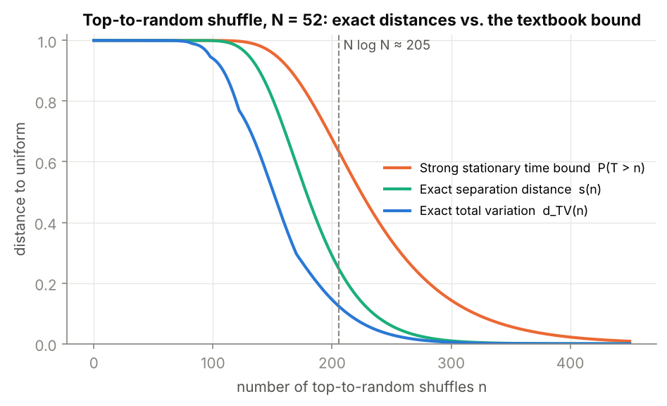
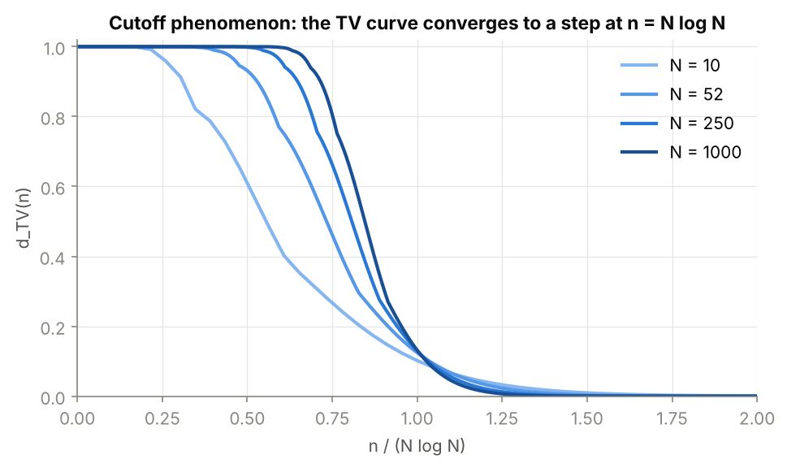
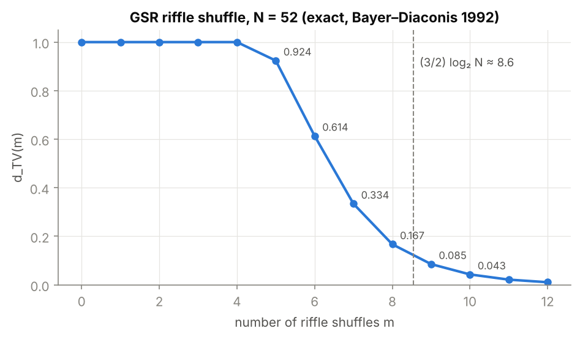
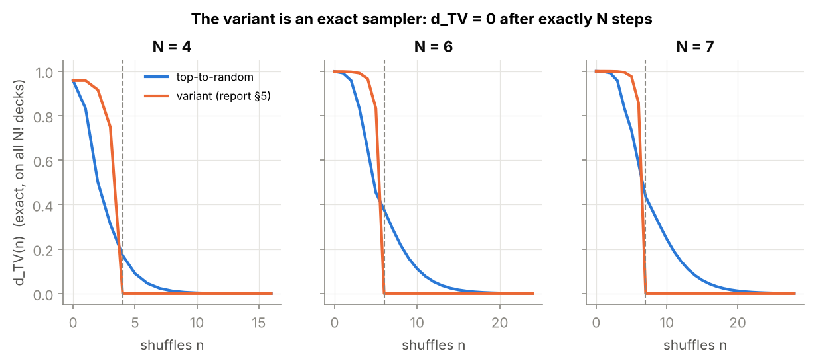

# How many shuffles randomise a deck? Exact mixing times on $S_{52}$

[](https://github.com/selimaklibi/card-shuffling-mixing-times/actions/workflows/tests.yml)
 

Card shuffles are random walks on the symmetric group $S_N$ ($52! \approx 8\cdot10^{67}$ states). This repository
computes **exactly** how far a shuffled deck is from uniform, for a 52-card deck, without ever enumerating $S_{52}$.
It started as a second-year research project (report in French: [`Battage_de_cartes.pdf`](Battage_de_cartes.pdf))
and was then extended with a tested Python implementation.

<p align="center"></p>

## Results

| Question (N = 52) | Answer | How |
|---|---|---|
| Top-to-random shuffles for $d_{TV} < 0.25$ | **179** | exact lumped formula |
| … for $d_{TV} < 0.05$ / $< 0.01$ | **235** / **281** | exact lumped formula |
| Textbook strong-stationary-time bound for $< 0.05$ | 357 (≈ 50 % too pessimistic) | $P(T>n)$, $T \sim$ coupon collector |
| $\mathbb{E}[T]$ | $N H_N = 236.0$ (vs. leading term $N\log N = 205.5$) | |
| Riffle (GSR) shuffles for $d_{TV} < 0.25$ | **8** ($d_{TV}=0.167$); 7 gives 0.334 | Bayer–Diaconis, exact rationals |
| Cut-off location | $n \approx N\log N$, window $O(N)$ | figure below, N up to 1000 |
| Report's "progressive insertion" variant | **exactly uniform after N steps** | brute force on all $N!$ decks |

All numbers are reproduced by `python scripts/make_figures.py`.

## Method

**1. Brute-force ground truth.** `shuffling.exact.ExactChain` evolves the full law $\mu_n$ on $S_N$ (sparse kernel,
$N \le 8$, i.e. up to 40 320 states). Every closed-form result below is unit-tested against it.

**2. Exact TV for the top-to-random shuffle at any N.** Distances to uniform are invariant under
$\sigma \mapsto \sigma^{-1}$, and the inverse walk is *random-to-top*. After $n$ random-to-top moves the deck is
"touched cards in order of last touch, then untouched cards in original order", so

$$
\mu_n(\sigma) = \frac{1}{N!}\sum_{j \ge N - s(\sigma)} \mathbb{P}(D_n = j)\,(N-j)!
$$

where $s(\sigma)$ is the length of the longest bottom block in original order and $D_n$ is the number of distinct
values among $n$ uniform draws (occupancy law, computed by dynamic programming). The sum over $52!$ permutations
collapses to a sum over $N$ classes; products are taken in log space so the code runs for $N = 1000$.

**3. Sharp separation.** The same reduction gives $s(n) = \mathbb{P}(D_n \le N-2)$ exactly. The classical strong
stationary time of the report (bottom card rises to the top, then is re-inserted) has
$T \overset{d}{=} \sum_{i=1}^{N}\mathrm{Geom}(i/N)$, so $s(n) \le \mathbb{P}(T>n)$ holds but **is not tight**:
the optimal time is a coupon collector for $N-1$ coupons, which saves exactly one $\mathrm{Geom}(1/N)$, i.e.
$N = 52$ shuffles on average.

**4. Riffle shuffle.** After $m$ GSR riffles a deck with $r$ rising sequences has probability
$\binom{2^m+N-r}{N}/2^{mN}$; grouping by $r$ with Eulerian numbers gives an $N$-term sum, evaluated with exact
`Fraction` arithmetic. A vectorised NumPy GSR simulator is validated against the formula by Monte Carlo.

<p align="center"> </p>

**5. The variant of section 5 of the report.** At step $t$ the top card is inserted uniformly among the last
$\min(t,N)$ positions. Each step inserts a fresh card into a uniformly ordered bottom pile, so this is an
insertion-based Fisher–Yates sampler and $d_{TV} = 0$ **exactly after N steps**, which is much faster than
$N\log N$. The report concluded that the variant only helps for small decks; the exact computation corrects that.

<p align="center"></p>

## Repository layout

```
shuffling/
  exact.py           brute-force law on S_N (ground truth, N <= 8)
  top_to_random.py   exact TV, exact separation, strong-stationary-time law for any N
  riffle.py          Eulerian numbers, rising sequences, Bayer–Diaconis TV, vectorised GSR
tests/               22 tests: closed forms == brute force, published 52-card table, Monte Carlo checks
scripts/make_figures.py
```

```bash
pip install -e ".[dev]"
pytest -q
python scripts/make_figures.py
```

## References

- D. Aldous & P. Diaconis (1986). *Shuffling cards and stopping times*. American Mathematical Monthly 93(5).
- D. Bayer & P. Diaconis (1992). *Trailing the dovetail shuffle to its lair*. Annals of Applied Probability 2(2).
- D. Levin, Y. Peres & E. Wilmer (2017). *Markov Chains and Mixing Times*, 2nd ed., AMS.

## Authors

Astrid Carbelo, Mehdi Belhamiti, Selima Klibi (Université Paris-Saclay, 2025). Python implementation and extensions: Selima Klibi.
